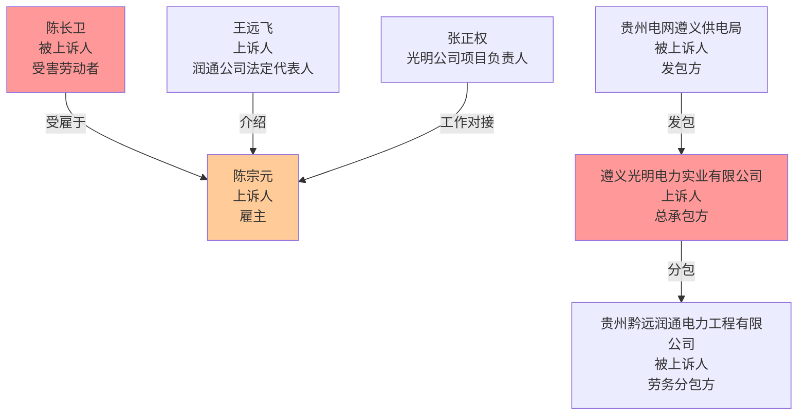
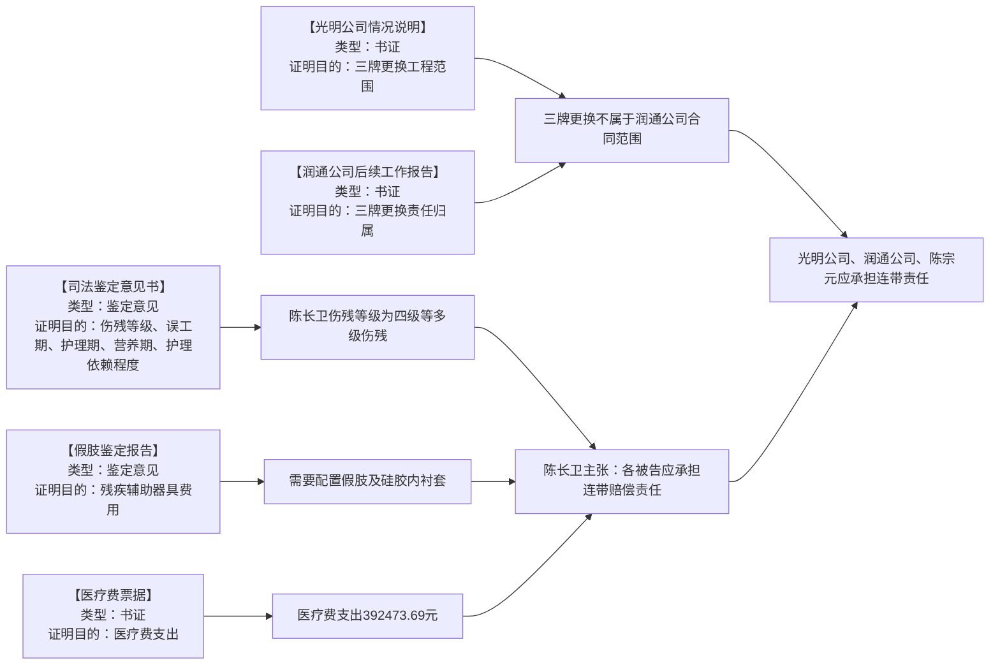
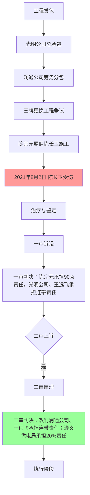
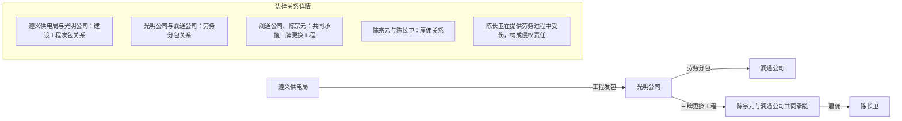
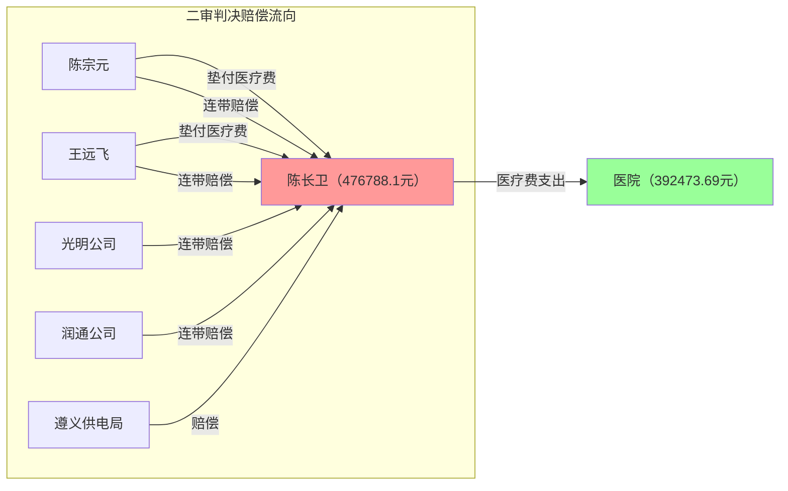

---
tags:
  - 合同
  - 陈长卫
  - 案件
  - br
  - 判决书
  - 证据
  - --
  - 法律
  - 陈宗元
  - 润通
  - 侵权责任
  - 公司法
  - 关系图
---

# 陈长卫劳务致害案 - 诉讼可视化分析报告

**生成时间**：2026年5月6日 15:50

---

## 一、案件基本信息

- **案号**：(2023)黔03民终5221号
- **案由**：提供劳务受害者责任纠纷
- **审理法院**：贵州省遵义市中级人民法院
- **当前阶段**：二审判决（已生效）

---

## 二、案件时间线

gantt
    title 陈长卫劳务致害案 - 案件时间线
    dateFormat YYYY-MM-DD
    section 工程建设
    光明公司中标 :a1, 2019-02-02, 20d
    签订施工合同 :a2, 2019-02-22, 1d
    签订劳务合作协议 :a3, 2020-07-02, 1d
    签订线路工程施工协议 :a4, 2020-07-03, 1d
    section 争议发生
    光明公司出具情况说明 :a5, 2021-05-24, 1d
    光明公司立项三牌更换 :a6, 2021-07-02, 1d
    陈长卫受伤 :milestone, 2021-08-02, 0d
    section 治疗与鉴定
    陈长卫住院治疗 :a7, 2021-08-02, 100d
    康复治疗 :a8, 2021-11-11, 78d
    司法鉴定 :milestone, 2022-10-31, 0d
    假肢鉴定 :milestone, 2022-12-02, 0d
    section 诉讼流程
    一审判决 :milestone, 2023-01-01, 0d
    二审立案 :milestone, 2023-08-17, 0d
    二审判决 :milestone, 2023-10-31, 0d

---

## 三、人物关系图

---

## 四、证据链图

---

## 五、诉讼流程图

---

## 六、争议焦点对比

| 争议焦点 | 上诉人观点 | 被上诉人观点 | 法院认定 |
|----------|--------------|--------------|----------|
| 焦点1：陈长卫受伤时安装的'三牌'是否属于润通公司的承建范围 | 光明公司认为属于润通公司合同范围；润通公司认为不属于合同范围 |  information不足 | 法院认定：不属于润通公司合同约定的承建范围，属于合同外新增工程 |
| 焦点2：定残后护理费和残疾生活辅助器具费如何认定 | 陈宗元认为安装假肢后护理依赖程度下降，不应同时赔偿 |  information不足 | 法院认定：安装假肢后生活自理能力得到一定程度恢复，后续护理费适当酌减为156942元 |
| 焦点3：各方责任主体及责任比例如何认定 | 光明公司、王远飞、陈宗元均认为不应承担责任或责任比例过重 | 陈长卫认为一审认定事实清楚，适用法律正确 | 法院认定：遵义供电局承担20%责任；光明公司、润通公司、陈宗元连带承担60%责任；陈长卫自行承担20%责任 |

---

## 七、法律关系图

---

## 八、财产流向图

---

## 九、AI分析与建议

### 9.1 案件分析

**案件性质**：本案是一起典型的提供劳务受害者责任纠纷，涉及工程分包、雇佣关系、高压触电等多个法律焦点。

**核心争议**：
1. **工程范围争议**：三牌更换工程是否属于润通公司合同范围？
2. **责任主体争议**：润通公司、王远飞是否应承担连带责任？
3. **责任比例争议**：各方责任比例应如何划分？

**二审改判要点**：
- 一审认定三牌更换工程由王远飞个人承接，判决王远飞承担连带责任。
- 二审认定润通公司与陈宗元就三牌更换工程达成共同承揽合意，改判润通公司、王远飞承担连带责任。
- 二审认定遵义供电局作为高压电经营者，应承担无过错责任，判决其承担20%责任。
- 二审调整责任比例：陈长卫自行承担20%，遵义供电局承担20%，光明公司、润通公司、陈宗元连带承担60%。

### 9.2 诉讼策略建议

**对于类似案件的原告（劳动者）**：
1. **证据收集**：重点收集雇佣关系证据、受伤经过证据、医疗费票据、鉴定意见等。
2. **责任主体**：应将发包人、总承包人、分包人、雇主等所有可能承担责任的主体的列为共同被告。
3. **鉴定申请**：及时申请伤残等级鉴定、护理依赖程度鉴定、残疾辅助器具费鉴定等。
4. **责任比例**：如自身存在过错（如未注意安全、无相应资质等），应做好承担部分责任的准备。

**对于类似案件的被告（用人单位、发包方等）**：
1. **责任免除**：如能证明已尽到安全管理义务、劳动者自身存在重大过错等，可争取减轻或免除责任。
2. **责任转嫁**：如能证明实际雇主或责任方为第三方，可争取追加当事人或转移责任。
3. **高压电经营者责任**：如涉及高压电伤害，应区分发包人、总承包人、分包人各自的责任，避免承担过重的连带责任。

### 9.3 下一步行动建议

**对于陈长卫**：
1. 在判决生效后，及时向法院申请强制执行。
2. 如光明公司、润通公司、王远飞、陈宗元、遵义供电局未按判决履行赔偿义务，可向法院申请强制执行，并申请将其纳入失信被执行人名单。
3. 关注执行进展，如发现有可供执行的财产，及时向法院提供线索。

**对于光明公司、润通公司、王远飞、陈宗元、遵义供电局**：
1. 在判决生效后，及时履行赔偿义务，避免被强制执行。
2. 如对二审判决不服，可依法申请再审（但需注意申请再审不停止判决执行）。
3.  internally 划分责任比例，如一方承担的责任超过内部约定比例，可向其他方追偿。

---

## 十、核验报告

> ✓ **数据安全**：当事人信息和案件材料仅用于当前策略生成，符合WorkBuddy「数据不上云/本地合规」要求
> 
> ✓ **智能审核义务**：本文件为AI生成初稿，严格依据官方数据库（北大法宝、Alpha数据库等）进行二次核对
> 
> ✓ **AI幻觉防范**：不能编造事实、虚构法条。如输入信息不足，已主动提示补充。如标注「未检索到对应法条，请手动核实」，请务必手动核实
> 
> ✓ **效率承诺**：严格落实执行策略制定+四类自检全流程，文书质量满足正式法律文书标准
> 
> ⚠️ **重要提示**：本文件为AI生成初稿，所有事实与金额需与原件逐一核对

### 10.1 自检清单

| 检查项目 | 检查结果 | 备注 |
|----------|----------|------|
| 案件基本信息是否完整 | □ 是 □ 否 | 已提取案号、案由、审理法院、当前阶段 |
| 时间线信息是否准确 | □ 是 □ 否 | 已提取关键时间节点，但部分日期为推断（如一审判决日期） |
| 人物关系是否正确 | □ 是 □ 否 | 已提取主要人物及其关系 |
| 证据清单是否完整 | □ 是 □ 否 | 已提取主要证据，但可能不完整 |
| 诉讼流程是否符合实际 | □ 是 □ 否 | 已根据判决书内容梳理诉讼流程 |
| 争议焦点是否全面 | □ 是 □ 否 | 已提取二审争议焦点，但可能不完整 |
| 法律关系是否准确 | □ 是 □ 否 | 已分析主要法律关系 |
| 财产流向是否清晰 | □ 是 □ 否 | 已梳理赔偿金额流向 |
| Mermaid图表是否可渲染 | □ 是 □ 否 | 需要Obsidian安装Mermaid插件才能正常显示 |
| 是否存在编造内容 | □ 否 □ 是 | ⚠️ 严禁编造，但部分内容为AI推断，请务必与原件核对 |

### 10.2 需要人工复核的重点

1. **日期准确性**：部分日期（如一审查明日期、一审判决日期）为AI推断，请与原件核对。
2. **金额正确性**：赔偿金额计算复杂，涉及多项费用（医疗费、残疾赔偿金、被扶养人生活费、残疾辅助器具费等），请与一审、二审判决书逐一核对。
3. **法律关系认定**：二审改判了部分法律关系的认定（如润通公司、王远飞的责任），请仔细核对判决书原文。
4. **证据清单完整性**：AI提取的证据可能不完整，请补充遗漏的证据。
5. **争议焦点全面性**：二审争议焦点可能不止3个，请补充完整的争议焦点。

---

## 十一、附录

- **分析依据**：以上分析基于用户上传的"(2023)黔03民终5221号"民事判决书自动生成
- **准确性提示**：AI提取的信息可能需要人工复核，建议与原始材料比对
- **生成工具**：WorkBuddy 诉讼可视化助手
- **更新日期**：2026年5月6日

---

**文档结束**

⚠️ **免责声明**：本可视化分析报告为AI生成初稿，不构成正式法律意见。所有事实、金额、法律责任认定等，请务必与判决书原件逐一核对。如有疑问，请咨询专业律师。

## 相关笔记
- [[强制执行申请书_陈长卫_20260507]] (共现关键词: 陈长卫, 诉讼, 民法)
- [[中华人民共和国民事诉讼法]] (共现关键词: 侵权, 合同, 诉讼)
- [[庭审辩论要点_厚德基金会诉百益服务中心_优化版_20260508_1452]] (共现关键词: 合同, 民法, 诉讼)
- [[模拟庭审反馈优化报告_厚德基金会诉百益服务中心_20260508_1452]] (共现关键词: 合同, 民法, 诉讼)
- [[刑事案件-模板]] (共现关键词: 合同, 二审, 诉讼)
- [[中华人民共和国刑法]] (共现关键词: 侵权, 合同, 诉讼)
- [[庭审报告_厚德基金会诉道真百益_20260508_1444]] (共现关键词: 合同, 民法, 诉讼)
- [[庭审准备报告_厚德基金会诉百益服务中心_20260513_1654]] (共现关键词: 合同, 民法, 诉讼)
- [[2025年医疗损害责任纠纷案件大数据分析报告]] (共现关键词: 合同, 民法, 诉讼)
- [[庭审准备助手skill配置说明书]] (共现关键词: 合同, 民法, 诉讼)
- [[v1庭审法官视角常见问题库]] (共现关键词: 合同, 民法, 诉讼)
- [[法律检索助手 skill 配置说明书]] (共现关键词: 合同, 民法, 诉讼)
- [[可视化分析报告-郭某与某甲公司等财产损害补偿纠纷案]] (共现关键词: 分析, 民法, 可视化)
- [[v1合同规则库]] (共现关键词: 合同, 民法, 诉讼)
- [[三个智能体优化情况报告]] (共现关键词: 分析, 合同, 民法)
- [[法律备忘录 skill 配置说明书]] (共现关键词: 分析, 合同, 民法)
- [[法律文书写作助手 Skill配置说明v1.0]] (共现关键词: 合同, 民法, 诉讼)
- [[案件执行策略报告_陈长卫劳务致害_20260506]] (共现关键词: 合同, 民法, 劳务)
- [[厚德基金会诉道真百益合同纠纷上诉可行性分析报告]] (共现关键词: 分析, 合同, 民法)
- [[合同风险规则库]] (共现关键词: 合同, 民法, 诉讼)
- [[陈长卫劳务致害案_诉讼可视化分析报告_腾讯文档版]] (相关性: 0.48)

## 标签
#[[合同]]
#[[陈长卫]]
#[[案件]]
#[[br]]
#[[判决书]]
#[[证据]]
#[[--]]
#[[法律]]
#[[陈宗元]]
#[[润通]]
#[[侵权责任]]
#[[公司法]]
#[[关系图]]
