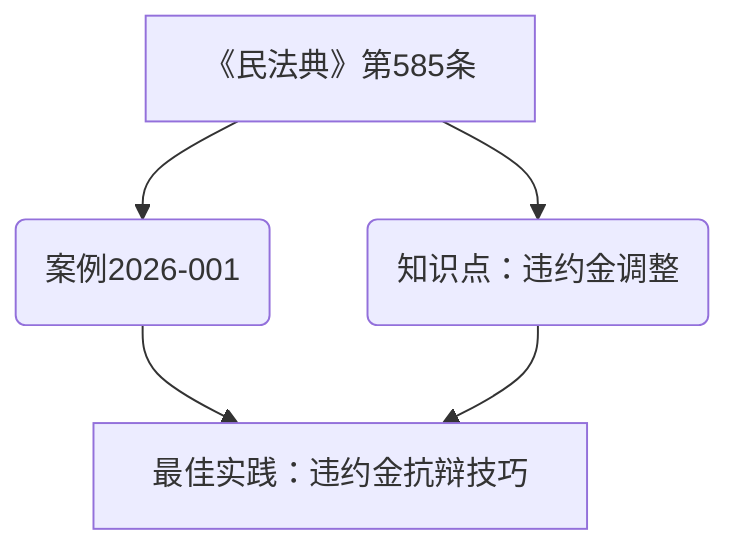

# 知识图谱构建指南

> **使用说明**：本文档指导如何构建和维护法律知识图谱。

---

## 一、知识图谱概述

### 1.1 什么是知识图谱
知识图谱是一种结构化的知识表示方式，将知识点以"节点"和"关系"的形式组织起来，形成知识网络。

### 1.2 为什么需要知识图谱
- **知识关联**：将分散的知识点关联起来，形成知识体系
- **智能检索**：支持复杂的知识查询和推荐
- **知识发现**：发现知识点之间的隐藏关系
- **知识复用**：快速找到可复用的知识点和最佳实践

---

## 二、知识图谱节点类型

### 2.1 法条节点
- **节点ID格式**：LAW-[年份]-[序号]，如 LAW-2026-001
- **节点属性**：
  - 法条名称
  - 法条内容
  - 发布日期
  - 生效日期
  - 发布机构
  - 效力状态

### 2.2 案例节点
- **节点ID格式**：CASE-[年份]-[序号]，如 CASE-2026-001
- **节点属性**：
  - 案例名称
  - 案号
  - 裁判日期
  - 审理法院
  - 裁判要旨
  - 法律依据

### 2.3 知识点节点
- **节点ID格式**：KP-[年份]-[序号]，如 KP-2026-001
- **节点属性**：
  - 知识点名称
  - 知识点类型
  - 核心内容
  - 适用条件
  - 例外情形

### 2.4 最佳实践节点
- **节点ID格式**：BP-[类别]-[序号]，如 BP-MS-001
- **节点属性**：
  - 最佳实践名称
  - 最佳实践类型
  - 适用场景
  - 操作步骤
  - 效果评估

### 2.5 文书模板节点
- **节点ID格式**：TEMPLATE-[文书类型]-[版本]，如 TEMPLATE-起诉状-v2.1
- **节点属性**：
  - 文书类型
  - 模板版本
  - 模板内容
  - 使用说明
  - 更新日期

---

## 三、知识图谱关系类型

### 3.1 引用关系
- **关系类型**：引用（CITE）
- **关系方向**：源节点 → 目标节点
- **关系示例**：
  - 案例 → 引用 → 法条
  - 知识点 → 引用 → 法条
  - 文书模板 → 引用 → 法条

### 3.2 关联关系
- **关系类型**：关联（RELATE）
- **关系方向**：双向
- **关系示例**：
  - 法条 ↔ 关联 ↔ 法条
  - 知识点 ↔ 关联 ↔ 知识点
  - 案例 ↔ 关联 ↔ 案例

### 3.3 应用关系
- **关系类型**：应用（APPLY）
- **关系方向**：源节点 → 目标节点
- **关系示例**：
  - 最佳实践 → 应用 → 法条
  - 最佳实践 → 应用 → 知识点
  - 文书模板 → 应用 → 最佳实践

### 3.4 优化关系
- **关系类型**：优化（OPTIMIZE）
- **关系方向**：源节点 → 目标节点
- **关系示例**：
  - 文书模板v2.1 → 优化 → 文书模板v2.0
  - 最佳实践v2 → 优化 → 最佳实践v1

### 3.5 总结关系
- **关系类型**：总结（SUMARIZE）
- **关系方向**：源节点 → 目标节点
- **关系示例**：
  - 案件经验 → 总结 → 最佳实践
  - 案例 → 总结 → 知识点
  - 法条 → 总结 → 知识点

---

## 四、知识图谱构建流程

### 4.1 节点提取
1. 从案件材料、法律文书、法律法规中提取节点
2. 为每个节点分配唯一ID
3. 填写节点属性

### 4.2 关系识别
1. 分析节点之间的逻辑关系
2. 确定关系类型和方向
3. 记录关系属性

### 4.3 图谱存储
1. 将节点和关系存储为Markdown格式
2. 使用Mermaid或PlantUML语法生成可视化图谱
3. 建立索引以便快速检索

### 4.4 图谱更新
1. 定期检查和更新节点信息
2. 添加新的节点和关系
3. 删除过时或错误的节点和关系

---

## 五、知识图谱可视化

### 5.1 使用Mermaid语法
````markdown

````

### 5.2 使用PlantUML语法
（略）

---

## 六、知识图谱检索

### 6.1 检索语法示例
- 查找与《民法典》第585条相关的所有案例
- 查找与"违约金调整"知识点相关的最佳实践
- 查找"庭审发问技巧"最佳实践应用了哪些法条

### 6.2 检索技巧
- 使用关键词检索
- 使用分类检索
- 使用关系检索

---

**最后更新时间**：2026年6月15日 21:45
**指南状态**：✅ 已启用 | 🔄 更新中


## 相关笔记
- [[每日综合学习报告-2026年07月07日]] (共现关键词: 知识点, ###)
- [[小强律师人伤法自学每日报告-2026年07月01日]] (共现关键词: 知识点, 民法, ###)
- [[律师办理劳动争议案件基本业务技能]] (共现关键词: 起诉, 关系)
- [[从请求权基础看民商事诉讼]] (共现关键词: 违约, 关系)
- [[最佳实践模板]] (共现关键词: 实践, 法条, 最佳)
- [[每日知识摄入-QQ补发摘要-2026-08-04]] (共现关键词: 知识, 起诉)
- [[知识图谱构建指南]] (共现关键词: 起诉, 构建, 图谱)
- [[memory]] (共现关键词: 知识, 图谱)
- [[数字分身系统智能化升级设计方案]] (共现关键词: 知识, 构建, 图谱)
- [[知识飞轮系统-索引]] (共现关键词: 知识, 图谱)
