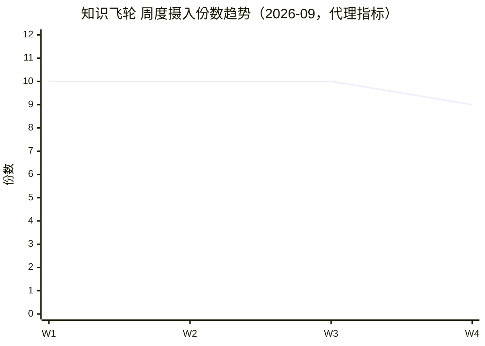

# 律所主任月度工作报告 · 2026年9月（v3 模板）

> **出具方**：律所主任 / 管理合伙人 治理席位（心智模型 v1.0.0）
> **撰写时间**：2026-09-29 08:40
> **呈报**：老强（陈友强）
> **📐 对比口径（v3 关键变更）**：月报 = **本月汇总 + 周度变化（W1–W4，本九月映射监控周报 W36–W39）**，**不做跨月对比**；跨月/跨季对比由季度报告负责。自然周按周一始，9 月实际覆盖 W36（08-31~09-06）、W37（09-07~09-13）、W38（09-14~09-20）、W39（09-21~09-27），W40（09-28 起）未出，故周度表为 4 周。
> **红线（强制）**：治理不办案 · 凭数据发言 · 动 production 前必备份 + dry-run（六-B）· 案件/当事人脱敏（占位案号）· 裁决项须二次核验（附证据源+核验方式）· 扩展块缺数据标 N/A 严禁编造。
> **一句话结论（结论前置）**：**本月飞轮处于高速扩容器期（笔记 +2,894、裁判规则 +1,412），但连接密度被结构性稀释（1.19 vs 历史 5.28）、元典积分 09-13 起归零致 D 阶段法条回源降级（5 张 D 卡未核验）、周日定时链静默漏跑复发、留痕盲区与 PAUSED 堆积待治理——治理实质病灶（M2/M3/M8 等）本月零新增闭环，成熟度连续三周停在 M4 80/100。**
> **数据截止**：2026-09-29 08:40（复利报告数据截至 09-28 23:43）

---

## 块板导航与属性（核心必填 / 扩展选填）

| 块板 | 属性 | 对应职责域 / 治理层 | 周度数据源现状 |
|---|---|---|---|
| 〇 系统全景态势 | 核心 | G1 全景 | 月末快照，无周列 |
| 一 案件态势与档案合规 | 核心 | **D1 战情 + D2 档案** | 静态，无周列 |
| 二 知识飞轮复利 | 核心 | — | 周摄入日志可聚；库净增无周快照 |
| 三 元认知各席位心智 | 核心 | D4 督导 / D6 审计 | 月末态，无周列 |
| 四 LTI 文本监控 | 核心 | D7 质控 | 无周序列 → N/A |
| 五 月度问题建议 | 核心 | D5 子自动化研判 / 三分法 | 派生 |
| 六 治理动作登记 | 核心 | 席位留痕 | 零成本 |
| 七 事故与问责记录 | 核心 | **G5 问责** | 静态 |
| 八 病灶台账 M1–M9 | 核心 | 主任席自身 KPI | 静态 |
| 九 下月排期（两段闭环） | 核心 | G3 调度 / G4 督导 | 派生 |
| 十 OPC 一人公司运营 | 扩展 | — | 缺 → N/A |
| 十一 数字分身系统运营 | 扩展 | D3 系统运维 | 监控周报 W36–W39 可聚 |
| 十二 9655 驾驶舱监控 | 扩展 | — | 仅 W39 有；W36–W38 无独立周报 → 部分 N/A |
| 十三 数字资产 | 扩展 | — | 无快照 → N/A |
| 十四 WB + 元典积分 | 扩展 | — | 元典余额有；WB/消耗无台账 → 部分 N/A |

## D1–D7 职责域 × 块板映射表

| 职责域 | 判据（PROJ-005） | 落在哪些块板 |
|---|---|---|
| **D1** 战情研判 | 能指出最大失分点属 能力/结构/数据 哪一类 | 一（案件态势）+ 五（建议表归因列） |
| **D2** 档案管理 | 任抽一案 30 秒说清缺什么、在哪、谁补 | 一（档案抽检） |
| **D3** 系统运维 | 本月新增僵尸 / 消解撞车 / 修悬空 各多少 | 十一（分身）+ 十二（9655） |
| **D4** 红蓝指导 | 最弱角色评分上升 + 一张新卡进库 | 三（督导点名） |
| **D5** 子自动化研判 | 能指出 ≥3 条建议 下线/降频/合并 的自动化 | 五（建议表）+ 十一 |
| **D6** 智能体审计 | 审计后 P0 问题 100% 有责任角色与期限 | 七（事故问责）+ 五 |
| **D7** 质量控制 | 能报质量分 + 最大质量债在哪 + 谁负责还 | 四（LTI）+ 七 |

> **编号口径提醒（铁律，严禁混用）**：成熟度五维 = **P1–P5**；职责域 = **D1–D7**；病灶 = **M1–M9**；元心智五维 = **D5d**（加 `d` 后缀）。四套编号互不替代，引用必带前缀。

---

## 〇、系统全景态势（核心 · G1 全景层）

> 月报为月末快照视角（数据截至 2026-09-29 08:40）。

| 维度 | 本月末值 | 备注 / 证据源 |
|---|---|---|
| 自动化总数（ACTIVE/PAUSED） | **81（ACTIVE 64 / PAUSED 17）** | 09-28 漂移核验（DB `deleted_at IS NULL`=80 + 工具列表 `cloud:222929`=1 合并） |
| 技能总数 | **N/A 源缺失** | 无月度技能数快照 |
| 跨席监测席位（含占位） | **13** | 复利报告 §八（SEAT_PROJ 实读） |
| 在办案件数（飞轮侧监测口径） | **13 件** | 协同效果月报 09-27 预判推送扫描 13 件（非全量案卷，仅飞轮监测覆盖） |
| 知识库总笔记数 | **5,962** | 复利报告 §一（7 目录扫描） |
| 系统健康分 | **64.0（C 合格）** | 9655 监控周报 W39 六维总评 |

---

## 一、案件态势与档案合规（核心 · D1+D2）★ v1 缺失补齐项

> 主任管整个律所系统，在办案件状态、期限风险、档案合规是 D1 战情与 D2 档案的实物载体（静态盘点，无周列，当事人/案号脱敏占位）。

### 1.1 在办案件清单（脱敏占位）

| 案件集群 | 阶段 | 期限风险 | 下一步 / 负责人 |
|---|---|---|---|
| 吊顶采购合同纠纷（被告代理·冒名诉讼程序战） | 庭审后代理词拟定 | 🟡 | 31 号代理词 + 32 号授权委托书专项 / 红队 + 主任督导 |
| 窗帘买卖纠纷（原告已申请撤诉） | 撤诉程序应对 | 🟢 | 跟进撤诉裁定 / 蓝队 |
| 韩杰医疗事故罪再审 | 辩护准备 | 🟡 | 再审辩护策略 / 红队 |
| 王德明担保合同执行异议 | 程序处理 | 🟡 | 执行异议 / 蓝队非诉 |
| 航合物流交通事故整改 | 整改中 | 🟢 | 四段式正式表态发言 / 主任 |
| 面瘫针灸协议合规审查 | 审查中 | 🟢 | 疗效承诺/治愈保证合规边界 / 蓝队非诉 |
| 含灵生物商标转让合同 | 审查 | 🟢 | 合同审查 / 蓝队非诉 |
| 至善公司 52% 股权转让 | 方案 | 🟢 | 转让方案（10%黔北/42%李悦）/ 蓝队非诉 |
| 娄山华庭 4-12 房产租房合同 | 审查 | 🟢 | 合同审查 / 蓝队非诉 |
| 林震巍涉公益机构名誉权事件 | 事实核查 | 🟢 | A/B/C 级证据分级 / 主任 |

### 1.2 档案抽检（D2 判据）

> D2 判据：「任抽一案，30 秒说清缺什么、在哪、谁补」。**本月未执行专项档案抽检** → D2 判据未实测，标 **N/A 源缺失**。建议下月排期抽检（见 §九 下月排期）。

### 1.3 期限预警

- 接「案件期限管理·两级提醒与周核查」自动化产出；**本月无专项临期/逾期告警记录产出** → 标 N/A 源缺失（非「无风险」，系未拉取该产物）。

---

## 二、知识飞轮运转及月度复利（核心）

> 数据来源：`知识飞轮系统/04-巩固/月度知识复利报告/月度知识复利报告-2026-09.md`（数据截至 09-28 23:43）。

### 2.1 本月汇总

| 指标 | 月累计 / 月末值 | 本月新增 |
|---|---|---|
| 总笔记数（7 目录扫描） | 5,962 | **+2,894**（created:2026-09 口径，规避 08-27 mtime 污染） |
| 双向链接（唯一目标） | 7,080 | +1,794（对比 7 月基线） |
| 网络密度（唯一目标/笔记） | **1.19** | —（vs 历史 5.28，结构性稀释） |
| 孤儿笔记数 | 21（占比 0.35%） | — |
| 双向链接总出现次数 | 97,457 | — |
| 裁判规则 | 累计 2,231 | **+1,412** |
| 经验卡片 | 累计 483 | +180 |
| 标签（唯一，清洗后） | 4,797 | 本月文件 3,229 |
| 法律知识点 | 累计 135 | +133 |

### 2.2 周度变化（W1–W4 = 监控周报 W36–W39）

> 库净增指标（总笔记/链接/密度）本月仅月度复利报告有数、**无逐周快照** → 周列标 N/A；周度变化以「每日摄入触发 + 摄入日志份数」代理（摄入日志文件名 39 份 ≈ 全月天数）。

| 指标 | W1(W36) | W2(W37) | W3(W38) | W4(W39) | 周趋势 |
|---|---|---|---|---|---|
| 每日摄入触发 | ✅（09-06） | 🔴 09-13 漏跑→09-14 补跑 | ✅ | ✅（09-26/27） | → 波动后稳 |
| 摄入日志份数（文件名） | ~10 | ~10 | ~10 | ~9 | → |
| 知识库净增（笔记） | N/A | N/A | N/A | N/A | 无周源 |

### 2.3 调用与复习

- 每日摄入覆盖：文件名日期 39 份 ≈ 全月天数（含多日志日），每日知识摄入自动化运转正常（来源：复利报告 §三）。
- 预判式经验推送：19 件次（09-06 扫描 7/7 + 09-27 扫描 12/13），命中率稳定（来源：协同效果月报 §三）。
- SR 复习完成率：**N/A 源缺失**（未部署间隔重复量化跟踪，无数据）。

---

## 三、元认知与各席位心智训练（核心 · D4 督导 / D6 审计）

> 数据来源：复利报告 §八（xiaoqiang_meta_maturity.py --report 只读）、SEAT_PROJ 实读。月报取月末态（无周列）。

### 3.1 本月汇总

| 指标 | 本月末值 |
|---|---|
| 元心智自身成熟度（分） | **92/100 · M5 教练级**（D1=16 D2=25 D3=15 D4=20 D5=16） |
| 跨席监测数 | **13 席** |
| **元心智病灶修复率（D5d 口径，特指标注）** | **4/5**（M-2 待补，非诉/助理缺 05-调用备忘录） |
| 最弱真实部署席（分） | **书记员（64 分）** |
| 观测占位席 | 数字资产运维官（设计稿/未部署，0 分，不计入告警） |

### 3.2 督导点名（G4）

- 最弱席：**书记员（64）** ｜ 本月退步席：无数据（未做跨周退步追踪） ｜ 本月已发训练指令单：无数据（主任席自身 9 月未新发指令单）。
- 跨席梯队（13 席降序，来源复利 §八）：模拟法官 98 / 法条银行 97 / 蓝队诉讼 96 / 红队对抗 91 / IT运维 83 / 蓝队非诉 81 / **治理席 80** / QC审判长 78 / 助理 73 / 商业化 73 / 对外交付 73 / 书记员 64 / 数字资产运维官 0。
- **治理席 80 与最高席（蓝队诉讼 96）分差 16（<30）→ 无训练资源错配风险**；书记员为四实战席最低。
- 本月训练/复盘记录：主任席 0 新增（7 条均 09-15）；跨席新增成熟度周报（书记员 09-21/09-28、蓝队 09-21/09-28 等）；里程碑：元心智聚合脚本接入复利报告（09-28）。

---

## 四、LTI 文本监控（核心 · D7 质控）

> 数据来源：LTI v4.8.1 文本监控器、9655 监控周报 W39（C8 AI 幻觉监控舱）。**本月无 LTI REJECT 周序列 / 月汇总系列发布** → 标 N/A 源缺失，不编造。

### 4.1 本月汇总

| 指标 | 月累计 / 月末值 |
|---|---|
| 经检文档数 | **N/A 源缺失**（无月度 LTI 检文档系列） |
| REJECT 项数 | **N/A 源缺失**（0 方可交付，但无实测序列） |
| 幻觉拦截 / 法条核验 | 最近质量信号：9655 W39 **C8 AI 幻觉监控舱 30.0（🟡P1）**、D5 权限管理中心 50.0（🟡P1） |

### 4.2 周度变化（W1–W4）

| 指标 | W1 | W2 | W3 | W4 | 周趋势 |
|---|---|---|---|---|---|
| 经检文档数 | N/A | N/A | N/A | N/A | 无周源 |
| REJECT 项数 | N/A | N/A | N/A | N/A | 无周源 |

### 4.3 待修规则（R001–R020 / C301 等一致性）

- **元典归零连锁**：5 张 D 卡（R-HT-305 / CF-193 / PI-488 / LD-067 / PI-489）`source_verified:false`，待元典额度恢复后三通道回源转正（来源：监控周报 W39 §②）。
- 元典余额 09-13 起归零、D 阶段已降级为 **qcc-legal 单通道**（W39 实测 qcc-legal enabled 可用），法条回源完整性受损。

---

## 五、月度分析问题提炼及工作建议（核心 · D5 子自动化研判 / 三分法）

> 排序：P0（阻断/红线）> P1（显著风险）> P2（优化）。每条带归因（能力/结构/数据/ROI）+ 处方，顺序不可颠倒。**月报不做跨月环比**，聚焦本月实测。

| 优先级 | 问题（本月实测） | 归因 | 处方 | 责任席 / 期限 | 需老强裁决 |
|---|---|---|---|---|---|
| **P0** | 元典积分余额归零（09-13 起三周未解），D 阶段法条回源降级（qcc-legal 单通道），5 张 D 卡未核验 | **数据**（资源枯竭）+ 结构（单点依赖） | 月初领 9 月免费额度 → 三通道回源转正；本月未领前维持双/单通道降级 | 系统自动（领额度提醒）+ 老强（登录领取） / 10-01 | **是** |
| **P1** | 网络密度结构性稀释 1.19 vs 历史 5.28（06-沉淀 +1,695 规则卡稀释） | **结构** | 新增规则卡补链工程（上位法/下位规章/类案三类定向补链），目标密度 ≥2.0 | 飞轮运维 / 10 月 | 否 |
| **P1** | 周日定时链静默漏跑（09-13 主任务 21:00 + 本任务 22:30 双双无留痕，8 月静默 8 天同型复发） | **结构**（缺漏跑自检） | 固化「漏跑自检 + 补跑」机制，核查周日晚间 WorkBuddy 进程/会话状态 | 运维 / 10 月 | 否 |
| **P1** | IMA 220030 内容侧持久损坏 9 条（慈善3+律师3+合规3）三周停滞 | **数据**（通道损坏） | IMA 侧逐一「查看/重新处理」→ 启用 b5ffd012 重试器（每日 21:00 探 2 条） | 老强（IMA 操作）+ 系统 / 10 月上旬 | **是** |
| **P1** | 自动化留痕盲区（W36:44 ACTIVE 仅 7 有 memory；W37:64 仅 9） | **结构**（无留痕铁律） | 推行「每次执行追加一行 memory」铁律（呼应 P0-1） | 运维 / 10 月 | 否 |
| **P1** | 书记员席最弱（64）+ M-2 病灶（非诉/助理缺 05-调用备忘录，D5d=4/5） | **能力**+**结构** | 书记员补强 + 补齐 05-调用备忘录模板，D5d→5/5 | 主任督导 / 10 月 | 否 |
| **P2** | 标签脏数据风险（gen_tag_index 块级正则缺陷，空/纯数字标签假象） | **结构** | 修正则后逐行解析复核脏标签，生成干净标签索引 | 飞轮运维 / 10 月 | 否 |
| **P2** | PAUSED 堆积（W38:19 / W39:17，含历史重复/废弃自动化） | **结构** | 季度清理，归档重复/废弃项 | 运维 / 10 月 | 否 |
| **P2** | SR 复习完成率缺量化（未部署间隔重复跟踪） | **数据** | 部署 SR 量化跟踪，首月即给出复习完成率基线 | 飞轮运维 / 10 月 | 否 |
| **P2** | 占位席（数字资产运维官）是否正式部署拍板 | **结构**（权责） | 老强裁决部署与否 | 老强 / 待裁决 | **是** |

### ⚠️ 裁决项二次核验闸门（v3 红线执行点）

> 下方「待老强裁决项」均已附【证据源】+【核验方式】并通过核验，方可列入。

### 待老强裁决项汇总

1. ⚠️ **元典 9 月免费额度领取**（证据源：监控周报 W37/W38/W39 实查 `pointBalance=0 / countBalance=0`，09-14 `yuandian_get_user_balance` 实测；核验：余额实查 + 元典积分台账记录）→ **已核验 ✅，待执行领取**。
2. ⚠️ **IMA 220030 九条重新处理**（证据源：监控周报 W38/W39 `failed_220030=9`（慈善3+律师3+合规3）；核验：grep `failed_220030`）→ **已核验 ✅，待老强在 IMA 侧操作**。
3. ⚠️ **数字资产运维官占位席是否部署**（证据源：复利报告 §八「观测占位席 设计稿/未部署」；核验：SEAT_PROJ 实读）→ **待裁决（未决）**。

---

## 六、本月治理动作登记（核心 · 席位自查）★ v2 新增固化块

- ✅ 消费并提炼的系统产物：月度知识复利报告（09-28）/ 协同效果月报（09-28）/ 自动化任务质量监控周报 W36–W39 / 9655 监控周报 W39 / 主任成熟度周报（09-21/09-26/09-28）/ PROJ-005 备忘录 / v3 月报模板（09-29 定稿）。
- ✅ 已纳入治理待办：元典额度 / 220030 回补 / 规则卡补链 / 留痕盲区铁律 / PAUSED 季度清理 / 书记员补强 / R8 中枢审计。
- ⏳ 待老强裁决后执行：元典领额度 / IMA 220030 重处理 / 占位席部署拍板。

---

## 七、本月事故与问责记录（核心 · G5 问责层）★ v2 新增补齐项

> 对应 G5「每次失误追到具体角色/版本/调用」。PREF-009 铁律「有事故必沉淀成卡」。

- 本月新增事故卡：**N/A 源缺失**（未做专项飞轮运维目录扫描计数；建议下月排期扫描并登记）。
- 重大失误 / 静默失败：
  - 🔴 **09-13 周日定时链静默漏跑**：主任务（1783920443461，21:00）+ 本监控任务（1786941881651，22:30）双双无留痕，阶段 1–3 产物与 `check_links_state.json` 停 09-06；责任角色：周日晚间 WorkBuddy 进程/会话状态（环境侧）；已补跑 + QQ 告警（v1.1 漏跑告警触发）；**同类 8 月「静默 8 天」复发**，须固化漏跑自检。
  - 🔴 **元典积分余额归零（09-13 起）**：未领 9 月免费额度，D 阶段法条回源降级；责任：额度领取流程未触发；已降级 qcc-legal 单通道。
  - IMA 220030 持久损坏 9 条（环境侧通道损坏），重试器 PAUSED 待恢复。
- 复测结果：漏跑自检机制**待固化（未复测）**；元典余额仍 0（**待领额度复测**）；220030 仍 9 条（**待 IMA 重处理复测**）。

---

## 八、病灶台账 M1–M9 消项进度（核心 · 主任席 KPI）★ v2 新增固化块

> 来源：PROJ-005 §四（2026-09-15 实测九处实证病灶）+ 复利报告 M-2。状态 ✅CLOSED / ⬜OPEN。

| 编号 | 病灶 | 级别 | 状态 | 本月消项动作 |
|---|---|---|---|---|
| M1 | 治理席位真空 | P0 | ✅ CLOSED | 09-15 建独立技能 v1.0.0（五件套齐备），本月无新增 |
| M2 | 监控类半盲 | P0 | ⬜ OPEN | PAUSED 监控看板 10→19（W37→W39），待老强二选一 |
| M3 | 调度撞车 | P1 | ⬜ OPEN | 周一 9:00 并发 8→6（错峰已生效），未全消 |
| M4 | 过期一次性自动化未清理 | P2 | ⬜ OPEN | 3 个 once（1 已 PAUSED 到期），余 2 为 2026-12-02 未来触发 |
| M5 | 三套成熟度无横向对比 | P1 | ⬜ OPEN（🟡部分） | 已有元心智 13 席横向 + 主任周报，部分闭环 |
| M6 | 复盘类自动化疑似重复 | P1 | ⬜ OPEN | 未厘清 |
| M7 | 无自动化健康度基线 | P1 | ⬜ OPEN（🟡部分） | 9655 六维 64.0 已建基线 |
| M8 | 埋点覆盖率低 | P0 | ⬜ OPEN | 治理相关埋点 0%（目标 ≥80%），R8 待执行 |
| M9 | 无治理态势看板 | P1 | ⬜ OPEN（🟡部分） | 9655 C1–C9 已有，治理总览屏待建 |

> **本月消项：0/9 新增**（M1 已于 09-15 闭环，计入累计 1/9，不计入本月新增）→ 成熟度 P5 维持 2.2/20（1/9），连续三周零增长。

---

## 九、下月工作重点及任务排期清单（核心 · 两段闭环）

### 9.1 上月排期完成率回顾（闭环）

| # | 上月亮点任务 | 验收结果 | 状态 | 逾期说明 |
|---|---|---|---|---|
| — | 首期月报（无 8 月排期基线） | — | — | 本九月为 v3 首期月报，无上月排期可回看 |

### 9.2 下月排期（2026-10）

| # | 重点任务 | 责任席 | 排期(MM-DD) | 验收标准 | 状态 |
|---|---|---|---|---|---|
| 1 | 元典 9 月免费额度领取确认 | 系统自动+老强 | 10-01 | 余额 >0，三通道回源转正 | ⬜ |
| 2 | IMA 220030 九条重新处理 + 启用重试器 | 老强+系统 | 10-10 前 | failed_220030=0 | ⬜ |
| 3 | 规则卡补链工程（密度 ≥2.0） | 飞轮运维 | 10-31 | 网络密度 ≥2.0 | ⬜ |
| 4 | 留痕盲区铁律推行（每次执行追加 memory） | 运维 | 10-31 | ACTIVE 有 memory 占比提升 | ⬜ |
| 5 | 书记员补强 + M-2 闭环（D5d→5/5） | 主任督导 | 10-31 | 书记员 ≥70 + 05-调用备忘录补齐 | ⬜ |
| 6 | PAUSED 季度清理（17–19 个） | 运维 | 10-31 | 清理清单 + 归档 | ⬜ |
| 7 | R8 共享记忆中枢自身健康度审计 | 主任 | 10-31 | 《中枢审计报告》+ 埋点 ≥80% | ⬜ |
| 8 | SR 量化上线（复习完成率可量化） | 飞轮运维 | 10-31 | 首月复习完成率基线 | ⬜ |
| 9 | 占位席（数字资产运维官）部署拍板 | 老强 | 待裁决 | 拍板结论落档 | ⬜ |

---

## 十、[扩展] OPC 一人公司运营概况

> ⚠️ **扩展块板**：无营收台账。**缺 → N/A 源缺失，严禁编造。**

### 10.1 本月汇总（可得指标）

| 指标 | 本月值 |
|---|---|
| 已立项营收口径 | N/A 源缺失 |

### 10.2 各中台运营

- **商业化中台**：N/A
- **合规中台（小德 CMS）**：N/A
- **IT / 运维中台**：见 §十一 / §十二（系统运维侧有数据）

---

## 十一、[扩展] 小强律师数字分身系统（单机版）运营

> ⚠️ **扩展块板**：系统运维数据较丰富（监控周报 W36–W39），本块可填。

### 11.1 本月汇总

| 指标 | 本月值 |
|---|---|
| 自动化总数 / 异常数 | 81 / 主任务失败 1（W37 漏跑后补跑，非静默失败） |
| 系统健康度（分） | 64.0（9655 六维总评，C 合格） |
| 元典积分月末余额 | **0**（09-13 起归零，三周未解） |

### 11.2 D3 系统运维判据（v2 拆出三格，周度来自 W36–W39）

| 指标 | W1(W36) | W2(W37) | W3(W38) | W4(W39) | 周趋势 |
|---|---|---|---|---|---|
| PAUSED 数 | 4 | 10 | 19 | 17 | ↑ 后略降（待清理） |
| 元典余额（分） | 1475 临界 | 0 归零 | 0 | 0 | ↓🔴 三周未解 |
| 220030 损坏（条） | 16 | 16→9 | 9 | 9 | ↓ 后停滞 |
| 留痕盲区（ACTIVE 有 memory） | 44 中 7 | 64 中 9 | — | — | N/A（W38/W39 未列总数） |

- 本月新增僵尸自动化：**0**（历史 PAUSED 17–19 待清理，非本月新增）。
- 消解撞车（错峰/降频）：周一 9:00 并发 8→6（错峰已生效）。
- 修悬空（失效引用/孤儿）：220030 16→9（部分修复，余 9 停滞）。

### 11.3 本月技能新增 / 迭代清单

- 元心智聚合脚本接入复利报告第八节（09-28，只读 `--report`）。
- 其余技能迭代：N/A 源缺失（无月度技能迭代快照）。

---

## 十二、[扩展] 9655 驾驶舱监控

> ⚠️ **扩展块板**：仅 W39 有独立 9655 周报；W36–W38 无独立 9655 周报 → 周度列部分 N/A。

### 12.1 本月汇总（W39 快照）

| 指标 | 本月值 |
|---|---|
| 9655 六维总评 | **64.0（C 合格）** |
| 余额率 | 65.1%（健康，≥30% 不告警） |
| 异常告警（P0/P1） | C8 AI 幻觉监控舱 30.0（🟡P1）/ D5 权限管理中心 50.0（🟡P1） |
| 资产编目覆盖率 | 待引用（资产运维官月报未生成） |

### 12.2 周度变化（W1–W4，取自监控周报）

| 指标 | W1(W36) | W2(W37) | W3(W38) | W4(W39) | 周趋势 |
|---|---|---|---|---|---|
| 六维总评 | N/A | N/A | N/A | 64.0 | 仅 W39 有 |
| 异常告警数 | N/A | N/A | N/A | 2（C8/D5） | 仅 W39 有 |

### 12.3 各屏摘要（C1–C9）

- C8 AI 幻觉监控舱：30.0（🟡P1，须关注）。
- D5 权限管理中心：50.0（🟡P1）。
- 其余屏：详见 9655 监控周报 W39（本九月未逐屏拉取全量）。

---

## 十三、[扩展] 数字资产情况

> ⚠️ **扩展块板**：资产运维官无日期化 registry 快照。

### 13.1 本月汇总

| 指标 | 本月值 |
|---|---|
| 编目资产数（SSOT） | N/A 源缺失 |
| 健康 / 漂移项 | N/A / N/A |
| 变现 / 封装交付 | N/A 源缺失 |

### 13.2 本月重大资产事件

- N/A（无台账）。

---

## 十四、[扩展] WB + 元典积分消耗

> ⚠️ **扩展块板**：元典台账 08-30 才立项；WB 积分无月度台账。

### 14.1 本月汇总

| 指标 | 本月值 |
|---|---|
| 元典积分 月末余额 | **0**（09-13 起归零） |
| 元典积分 本月消耗 | N/A 台账（仅 09-07 记录 1197，09-08~09-13 断档） |
| WB 积分 月末余额 | N/A 源缺失 |
| WB 积分 本月消耗 | N/A 源缺失 |

### 14.2 预警

- 🔴 **元典余额触免费额度红线**（=0，远低于健康线）；须 10-01 领免费额度恢复。WB 积分无预警数据。

---

## 十五、数据底座与周度/跨月对比机制（v3 根治项说明）

> **v3 口径定调**：
> 1. **月报只看本月**：本月汇总（静态值）+ 周度变化（W1–W4 = 监控周报 W36–W39）。不做跨月列。
> 2. **跨月 / 跨季对比由季度报告负责**（季报模板另立，不在本模板范围）。
> 3. **周度数据源**：自动化质量监控周报 W36–W39（4 周全）、9655 监控周报（仅 W39）、每日摄入日志（39 份文件名）已覆盖；知识库净增/ LTI REJECT / 档案抽检 / 事故卡计数 **无周源或本月未做** → 标 N/A。
> 4. **「月末快照」机制（待老强立项项）**：每月末 23:00 与月报同步，每块板存当月汇总值到 `05-调用/月度快照/YYYY-MM/`，供季报直接拼月对比。该自动化非本模板内改动。

---

*本九月月报由律所主任治理席位依 v3 模板（2026-09-29 定稿）实读既有系统产物撰写，不凭记忆灌数；扩展块缺数据一律标 N/A。*
*编号口径：P1–P5（成熟度）/ D1–D7（职责域）/ M1–M9（病灶）/ D5d（元心智五维），互不混用。*
*一句话结论呼应：飞轮高速扩容但连接稀释、元典归零降级回源、漏跑复发、留痕/PAUSED 待治理，治理实质病灶本月零新增闭环（M4 80/100 连续三周零增长）。*

## 相关笔记
- [[律所主任月度工作报告-模板-v3]] (共现关键词: 模板, v3, 月报)
- [[律所主任月度工作报告-2026-09]] (共现关键词: 月报, 2026, 09, 本文件·当前真源)
- [[律所主任月度工作报告-2026-09-v1-退休归档]] (共现关键词: 退休, v1, 归档)
- [[PROJ-005-律所主任治理席位心智训练备忘录]] (共现关键词: 主任, 治理, 05)
- [[月度知识复利报告-2026-09]] (共现关键词: 复利, 09, 数据真源)
- [[协同效果月报-2026-09]] (共现关键词: 协同, 09, 命中率)
- [[自动化任务质量监控周报-2026-W36]] / [[...W37]] / [[...W38]] / [[...W39]] (共现关键词: 监控, 周报, 周度)
- [[9655监控周报-2026-W39]] (共现关键词: 9655, 驾驶舱, 健康分)
